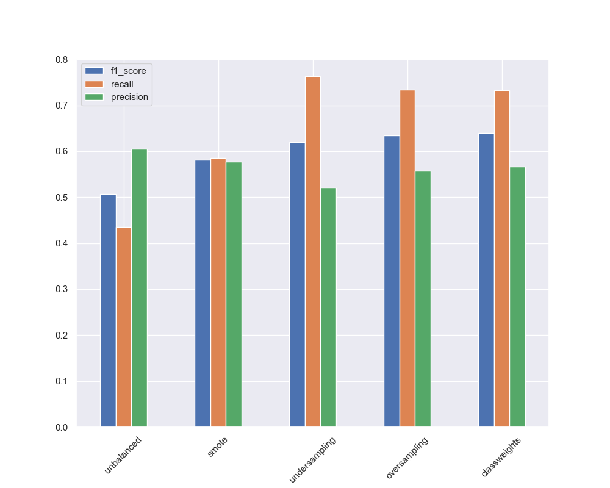
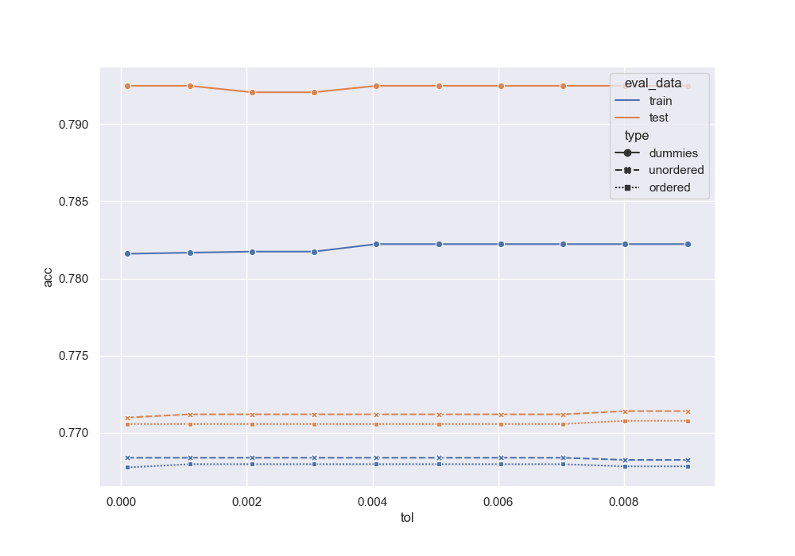

# Practical tips for Data Scientists

This talk, given at an ABN AMRO hackathon to prepare for a kaggle competition, was aimed at giving some practical tips to data scientists. The tips are aimed at people fairly new to the field but also those medior and hopefully even some seniors can learn something from it. The goal of these tips is to clarify some unexpected behaviour when working with data and models, as well as put a spotlight on some common pitfalls. 

It covers six main topics: 
1. Business tips
2. Short tip on models
3. Ordinal/Nominal data encodings
4. Feature Importance with Trees
5. Class Imbalance
6. Order of pre-processing

## Some highlights:

### Effects of imbalanced data sampling techniques with lower amounts of data

### Effectiveness of certain techniques keeping amount of data constant

### Behaviour of KNN with different encodings

### And the same effects on an SVM

