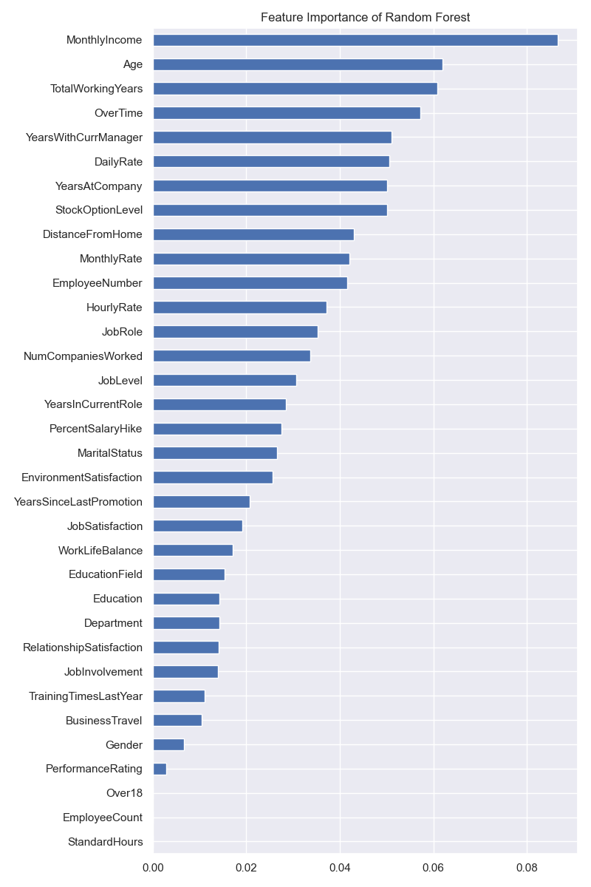
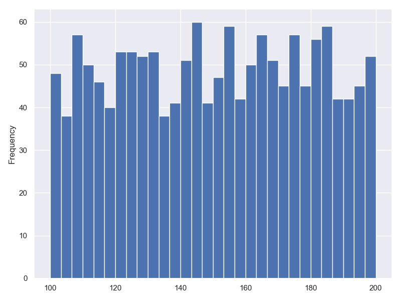
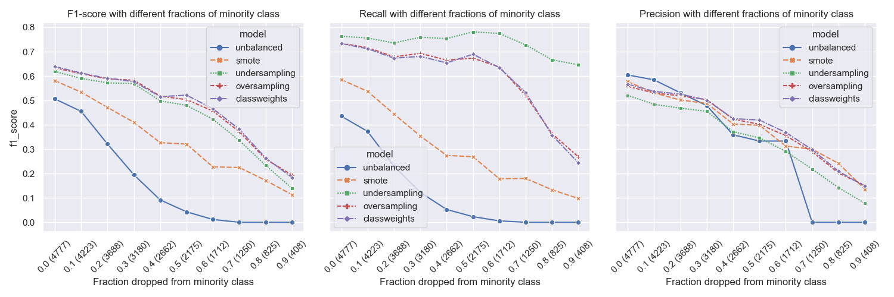

<!-- _class: invert -->
<!--  -->

## Practical Data Science

Bauke Brenninkmeijer

<!-- footer: Kaggle Competition for Jr. Data Science • ABN AMRO 2022-->

---

<!-- paginate: true -->

## Goal

Tell you what `works`
and `doesn't work`

<!-- footer: Practical Data Science • Bauke Brenninkmeijer -->

---

## whois:`Bauke Brenninkmeijer`

- MSc in CS and Data Science @Nijmegen
- Data Scientist @ABNAMRO since 2019
  - 1.5 years in Data Management
  - ~1 years in Global Markets
- Co-hosted The FastAI MOOC Meetup 2 years @AMS

- [](https://github.com/Baukebrenninkmeijer) [@baukebrenninkmeijer](https://github.com/Baukebrenninkmeijer)

---

## Regarding models

Most examples are with Random Forest or Decision Trees.

- Often one of the strongest models (RF)
- Easily implementable with Scikit-learn
- Easily accessible explainability features
- Requires little data preprocessing, like scaling or OHE.

*General tip: start with Random Forest*

---

## Feature engineering

Often harder than it looks

---

## Ordinal/Nominal variables

Let's discuss categorical encoding vs. one-hot encoding (dummy)


When does it matter?

---

## Categorical vs OHE for models

- **Depends on how they optimize.**
If they use distance metrics on the data, this encoding matters (e.g., K-means, LinReg, NN, SVM).
*For example: S and M are closer than S and L.*
- If other measures are used, such as information gain, sometimes they can be considered equivalent.
E.g., with **trees** with unlimited depth, both encodings are essentially equivalent.

---
<!-- _class: invert -->

## Tree Splitting Example


---
<!-- _class: invert -->

## Tree Splitting


---
<!--
_paginate: false
_footer: "" -->

## <!-- fit --> Decision Tree


<ul style="font-size:0.45em">
    <li>OHE worse on train than on test</li>
    <li>When parameters are reduced, the added value of ordered ordinal data becomes clear. </li>
</ul>

---
<!--
_paginate: false
_footer: "" -->

## KNN


<ul style="font-size:0.45em">
    <li>Ordinal and Nominal are identical here</li>
    <li>Both outperform OHE</li>
</ul>

---
<!--
_paginate: false
_footer: "" -->

## <!-- fit --> SVM


<ul style="font-size:0.45em">
    <li>With SVM, OHE is better.</li>
    <li>Ordered Categorical is actually the lowest</li>
    <li>Can be caused by an incidental increase in linear separability with random ordering.</li>
</ul>

---
<!-- _class: invert
footer: Feature Importance • Practical Data Science • Bauke Brenninkmeijer
-->


# Feature Importance with tree-based models

---

Trees have the awesome `.feature_importance_` attribute.

But
*Tree-based models have a strong tendency to overestimate the importance of continuous numerical or high cardinality categorical features.*

---

## Let's see this in practice

- `Binary classification` on whether employees will leave the company (attrition)
- Data is mix of discrete and continuous.
- Explanation can be used by senior management to mitigate.

---

## Feature importance



Most important:

- `MonthlyIncome`
- `Age`
- `WorkingYears`

---

## Let's mess with shit

We'll add a single random continuous variable in the range [100, 200].



---

## <!-- fit --> New feature importances


- 7th highest is random...????
- What does this mean for variables below random? No value?

---

## Can go further

Let's also add a discrete random variable


*Much less important than the continuous variable.*

---

## Why?

- Impurity Based Importance (Gini, Entropy or MSE)
- This is biased towards `high cardinality` features, cause it can split more.
- Can give high importance to unpredictive variables due to `overfitting`.
- Feature importance is calculated purely on the training data. Does not reflect performance on unseen data.

---

## <!--fit--> The solution: Permutation Importance

- Model agnostig way to determine importance of features for trained model.
- Can be applied on unseen data.
- Calculates impract of variable based on how much the model performance decreases

---

## Algo

1. Calculate baseline score (`.score`)
2. Shuffles a feature and recomputes score
3. ⬇performance == ⬆ importance

*What happens with correlated columns?*

---


---
<!-- _class: invert -->

# Class Imbalance

---
<!-- footer: Class Imbalance • Practical Data Science • Bauke Brenninkmeijer -->

Techniques typically used:

- Oversampling
- Undersampling
- Smote

These methods increase complexity with often limited results.

**But there is another intuitive way!**

---

<!-- _paginate: False -->

## SMOTE

- `Synthetic Minority Oversampling Technique`
- Creates synthetic points to increase the number of observations in minority class


---

## Oversampling

- Fix class imbalance by looking more at the minority class
- I.e., duplicate minority data points


---

## Undersampling

- Only look at the same number of data points in the majority class, as there are in the minority class.
- I.e., drop part of the data


---

## Class Weights

- Default part of sklearn
- Allows one to penalise minority errors more
- Assign weights to classes such that the weighted sums is equal.

$$
n_{minority} \times w_{minority} = n_{majority} \times w_{majority}
$$

---

We'll look at a dataset of employees interested in switching jobs

Target is imbalanced:


---

We train a classifier on SMOTE, undersampling, oversampling and class weights and compare the results.

---


---

## What happens if we make the data more imbalanced?

---




---

# Take away

- Class weights are a useful addition to the imbalanced learning toolbox.
- Very similar to oversampling in performance
- Try several imbalanced learning solutions and see what works!

---
<!-- _class: invert -->

# Order of pre-processing

---

## Order of pre-processing

- **Never** do distribution based transformations **before** splitting train/test
- Splitting should (almost) always be the first step, to prevent information leakage

```python
    # includes metrics from future test set
    df = StandardScaler().fit_transform(df)

    x_train, x_test, y_train, y_test = train_test_split(
        df.drop('target', axis=1),
        df.target,
    )
```

---

What we should do:

```python
    x_train, x_test, y_train, y_test = train_test_split(
        df.drop('target', axis=1),
        df.target,
    )

    scaler = StandardScaler()
    x_train = scaler.fit_transform(x_train)
    x_test = scaler.transform(x_test)
```

---

Goes for
- Standardscaler
- Min-max scaler
- Quantile scaler
- MaxAbsScaler
- etc.

---
<!-- footer: Practical Data Science • Bauke Brenninkmeijer -->

Thank you for listening.

# Questions?
