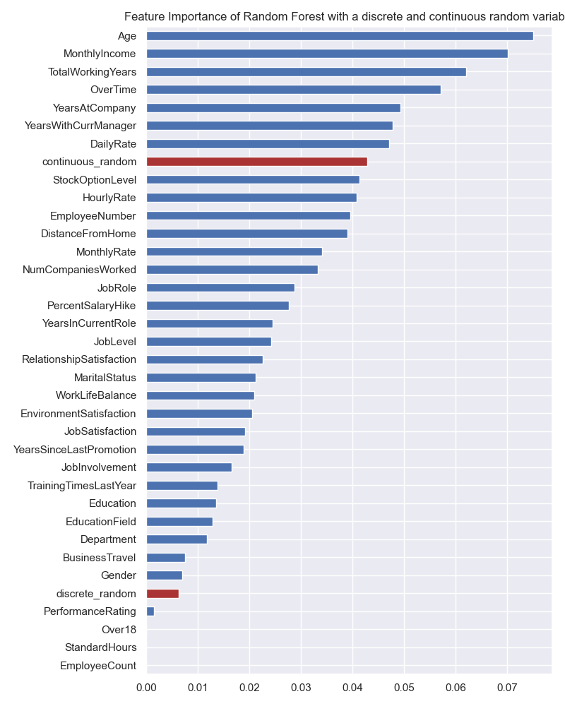

<!-- _class: invert -->
<!--  -->

## Practical Data Science

Bauke Brenninkmeijer

<!-- footer: Kaggle Competition for Jr. Data Science 2022 -->

---

<!-- paginate: true -->

## Goal

Tell you what `works`
and `doesn't work`
specifically when starting out
with data science

<!-- footer: Practical Data Science • Bauke Brenninkmeijer -->

---

## whois:`Bauke Brenninkmeijer`

- MSc in CS and Data Science @Nijmegen
- Data Scientist @ABNAMRO since 2019
  - 1.5 years in Data Management
  - ~1 years in Global Markets

- [](https://github.com/Baukebrenninkmeijer) [@baukebrenninkmeijer](https://github.com/Baukebrenninkmeijer)

---

## Feature engineering

It always looks simple

But mostly isn't

---

## Ordinal features

Let's discuss one-hot encoding vs. ordinal encoding


When does it matter?

---

## Feature Importance with tree-based models

Trees have the awesome `.feature_importance_` attribute.

But
*Tree-based models have a strong tendency to overestimate the importance of continuous numerical or high cardinality categorical features.*

---

## Let's see this in practice

- `Binary classification` on whether employees will leave the company (attrition)
- Data is mix of discrete and continuous.
- Explanation can be used by senior management to mitigate.

---

## Feature importance


Most important:

- `MonthlyIncome`
- `Age`
- `WorkingYears`

---

## Let's mess with shit

We'll add a single random continuous variable in the range [100, 200].


---

## <!-- fit --> New feature importances


- 7th highest is random...????
- What does this mean for variables below random? No value?

---

## I'll blow your mind even more

Let's also add a discrete random variable



*Much less important than the continuous variable.*

---

## Why?

- Impurity Based Importance (Gini, Entropy or MSE)
- This is biased towards `high cardinality` features, cause it can split more.
- Can give high importance to unpredictive variables due to `overfitting`.
- Feature importance is calculated purely on the training data. Does not reflect performance on unseen data.

---

# <!--fit--> The solution: Permutation Importance

- Model agnostig way to determine importance of features for trained model.
- Can be applied on unseen data.
- Algo:
  1. Calculate baseline score (`.score`)
  2. Shuffles a feature and recomputes score
  3. ⬇performance == ⬆ importance

*What happens with correlated columns?*

---
<!-- footer: Class Imbalance • Practical Data Science • Bauke Brenninkmeijer -->

## Class Imbalance

Techniques typically used:

- Oversampling
- Undersampling
- Smote

These methods increase complexity with often limited results.

**Luckily there is an intuitive way!**

---

<!-- _paginate: False -->

## SMOTE

- `Synthetic Minority Oversampling Technique`
- Creates synthetic points to increase the number of observations in minority class


---

## Oversampling

- Fix class imbalance by looking more at the minority class
- I.e., duplicate minority data points


---

## Undersampling

- Only look at the same number of data points in the majority class, as there are in the minority class.
- I.e., drop part of the data


---

## Class Weights

- Default part of sklearn
- Allows one to penalise minority errors more
- Assign weights to classes such that the weighted sums is equal.

$$
n_{minority} \times w_{minority} = n_{majority} \times w_{majority}
$$

---

## Order of pre-processing

- `Never` do transformations `before` splitting train/test
- Splitting should (almost) always be the first step, to prevent information leakage

```python
    scaler = StandardScaler()

    # Includes metrics from future test set
    df = scaler.fit_transform(df)

    x_train, x_test, y_train, y_test = train_test_split(
        df.drop('target', axis=1),
        df.target,
    )
```

---

What we should do:

```python
    x_train, x_test, y_train, y_test = train_test_split(
        df.drop('target', axis=1),
        df.target,
    )
    scaler = StandardScaler()
    x_train = scaler.fit_transform(x_train)
    x_test = scaler.transform(x_test)
```
